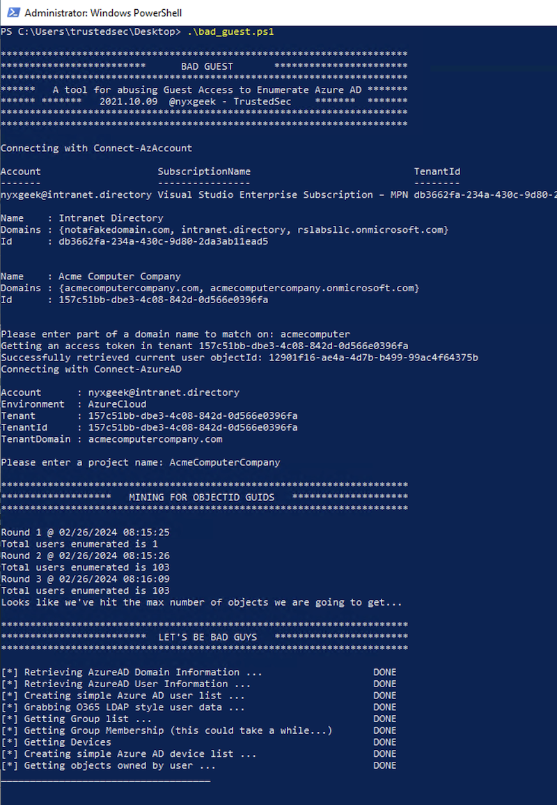

# Even Worse Guest

<p align="center">
    

This is a fork of **nyxgeek's [Bad Guest](https://github.com/nyxgeek/bad_guest)** tool, originally presented in TrustedSec's blog post: [Unwelcome Guest: Abusing Azure Guest Access to Dump Users, Groups, and More](https://trustedsec.com/blog/unwelcome-guest-abusing-azure-guest-access-to-dump-users-groups-and-more/).

## Overview

- I really do like the attack vector of the script so I first attempted to convert the tool's output into a JSON format that can be parsed by Azure/BloodHound ingestors, since that could be quite valuable to map the targets group structure and idenitfy valuable assets/users. However due to the limitations in data retrieval as a guest user, it is not possible to create a JSON file that can be directly ingested into the BloodHound database. However, the generated JSON is structured in a way that makes it parsable for inclusion in certain attack pipelines.
- Added hash tables to keep track of already processed groups and users. This ensures that each group and user is processed only once, reducing redundant operations and improving the script's execution speed.

## Limitations

- As a guest user, the script can only retrieve limited data from the Azure AD tenant. This means that some fields in the JSON output may be empty or null.
- The JSON output cannot be directly ingested into the BloodHound database due to the aforementioned data limitations. 

## Usage

   - Install the required PowerShell modules: `Az` and `AzureAD`.
   - Ensure you have appropriate permissions to access the target Azure AD tenant as a guest user.
   - The script generates a JSON file (`bh.json`) containing the collected data in the specified format.
   - Additional text files are created, including detailed lists of users, groups, and group memberships.

## Parsing the JSON Output

To further analyze the data collected by the `bad_guest` script, a Python script `analyze_bad_guest.py` is provided. This script parses the JSON output and generates statistics to help map the infrastructure based on group memberships.

### Features of the Parse Script

- **Statistics Generation**:
  - Identifies which users are in the most groups.
  - Finds which groups have the most members.
  - Calculates total numbers and averages.
  - Lists top users and groups based on memberships.
  - Provides mappings of users to groups and groups to users.
  - Highlights users not in any group.

- **JSON Relationship File**:
  - Saves all user and group relationships into a JSON file (`user_group_relationships.json`) for easier parsing and further analysis.

### Script Output

The script will output various statistics and save the user and group relationships into `user_group_relationships.json`. Sample output:

```bash
============================================================
User(s) in the most groups (10 groups):
============================================================
- Ken Takakura (ktakakura@example.com)

============================================================
Group(s) with the most members (50 members):
============================================================
- Occult Research Club

============================================================
Total number of users: 200
Total number of groups: 50
============================================================
Average number of groups per user: 2.75
Average number of members per group: 11.00

============================================================
Top 5 users by number of group memberships:
============================================================
- Ken Takakura (ktakakura@example.com): 10 groups
- Momo Ayase (mayase@example.com): 8 groups
- Okarun (okarun@example.com): 7 groups
- Aira Shiratori (ashiratori@example.com): 6 groups
- Jiji (jiji@example.com): 5 groups

============================================================
Top 5 groups by number of members:
============================================================
- Occult Research Club: 50 members
- Alien Investigators: 30 members
- Psychic Users: 25 members
- Turbo Granny's Fans: 15 members
- Kaiju Enthusiasts: 10 members

============================================================
Group memberships for the top 5 users:
============================================================

Ken Takakura (ktakakura@example.com):
  - Occult Research Club
  - Alien Investigators
  - Psychic Users
  - Turbo Granny's Fans
  - Secret Agents
  - Time Travelers
  - Dimension Hoppers
  - Urban Legend Hunters
  - Mystery Solvers
  - School Council

Momo Ayase (mayase@example.com):
  - Occult Research Club
  - Alien Investigators
  - Psychic Users
  - Turbo Granny's Fans
  - Kaiju Enthusiasts
  - Manga Artists
  - Music Lovers
  - Fashion Designers

... (and so on for the other top users)

============================================================
User and group relationships have been saved to 'user_group_relationships.json'.
============================================================
```

### Structure of `user_group_relationships.json`

The JSON file contains mappings of users and groups for further analysis:

```json
{
    "users": {
        "user-guid-1": {
            "id": "user-guid-1",
            "displayName": "Ken Takakura",
            "userPrincipalName": "ktakakura@example.com",
            "mail": "ktakakura@example.com",
            "userType": "Member"
        },
        // ... other users
    },
    "groups": {
        "group-guid-1": {
            "id": "group-guid-1",
            "displayName": "Occult Research Club",
            "description": "Investigating the supernatural",
            "mail": "occultclub@example.com"
        },
        // ... other groups
    },
    "userGroups": {
        "user-guid-1": ["group-guid-1", "group-guid-2", ...],
        // ... other user to group mappings
    },
    "groupMembers": {
        "group-guid-1": ["user-guid-1", "user-guid-2", ...],
        // ... other group to member mappings
    }
}
```


## Acknowledgements

- **Original Author**: [nyxgeek](https://github.com/nyxgeek)
- **Original Tool**: [Bad Guest](https://github.com/nyxgeek/bad_guest)
- **TrustedSec Blog Post**: [Unwelcome Guest: Abusing Azure Guest Access to Dump Users, Groups, and More](https://trustedsec.com/blog/unwelcome-guest-abusing-azure-guest-access-to-dump-users-groups-and-more/)

## Original README:
bad guest

By default, Microsoft tries to restrict the ability for Guest users to retrieve user and group informaiton.

The Azure Portal and Microsoft Entra, Microsoft Graph, and the Azure PowerShell commandlets all block access to attempts to retrieve user lists.

Bad Guest shows a loophole, where if a Guest user is added to ANY group in the organization, they can proceed to retrieve user lists and group lists.


blog post:

https://trustedsec.com/blog/unwelcome-guest-abusing-azure-guest-access-to-dump-users-groups-and-more



